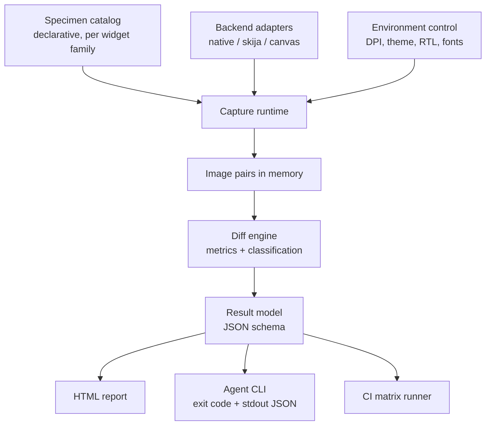
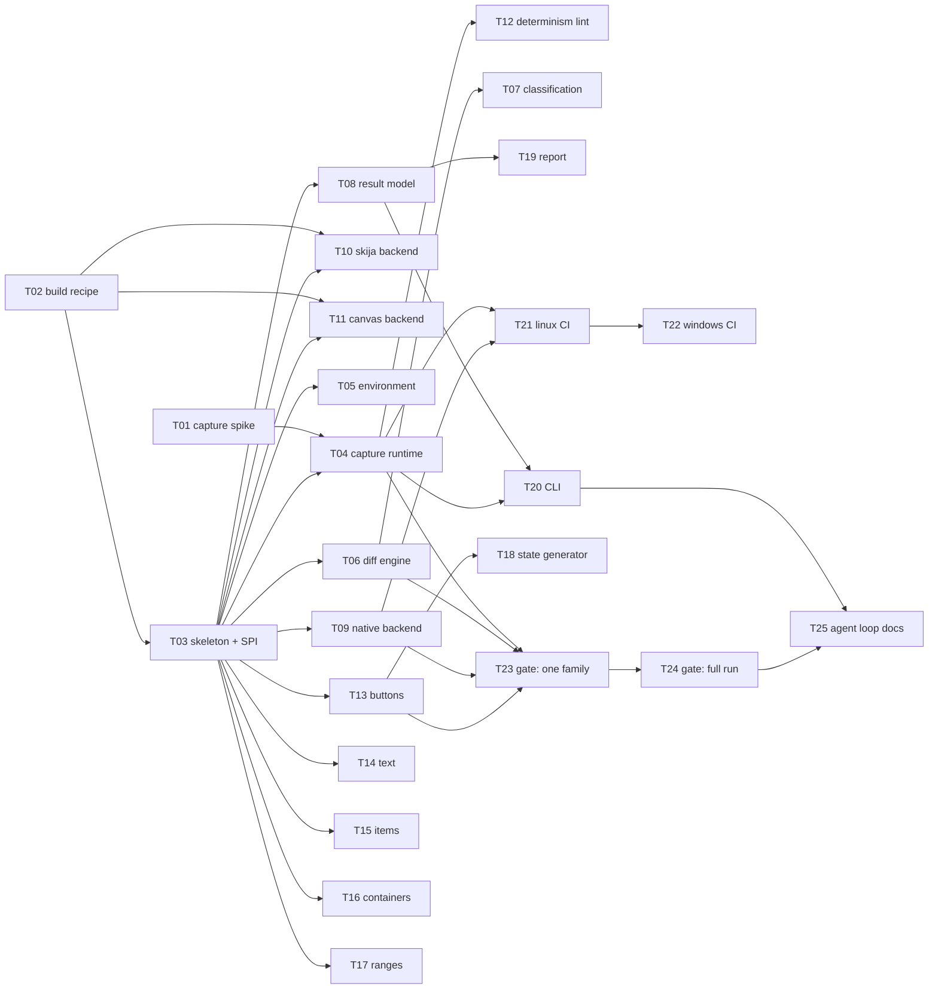

# SWT Visual Oracle: Plan

This is a living document.
The coordinator updates it whenever a task is merged, so that a worker starting later reads decisions rather than open questions.
Task status lives in `TRACKING.md`, not here; this document holds the design and the decisions behind it.

Merged so far: T02 (build recipe), T01 (capture strategy), T03 (SPI freeze).
The SPI sketch below is historical; `SPI.md` is authoritative.

## Goal

Build an automated visual oracle for SWT widget rendering.

For every widget, in every style, state, DPI scale, theme and text direction, the harness renders the widget twice in the same process: once through the native backend and once through the Skija backend.
It then diffs the two images and reports the differences in a machine-readable form.

The purpose is to remove the human from the inner loop.
Today a rendering defect in a Skija renderer is found by a person looking at a screenshot.
With this harness an agent can change a renderer, run one command, and get a verdict, which makes unattended iteration possible.

## Why this first

The rendering half of a Skija migration is not limited by how fast code can be written.
It is limited by how fast someone can look at pixels.
An hour of agent work produces more renderer changes than a person can visually verify in a day, so verification is the constraint that decides the schedule.

This harness is the single investment that lifts that constraint.
It is also self-contained, testable, and useful to both existing Skija efforts regardless of which one wins architecturally.

## Non-goals

Not a golden-image regression suite for native SWT itself.
Not a performance benchmark.
Not a replacement for the existing JUnit suites.
Not a general screenshot testing framework for applications built on SWT.

## Key design decisions

### D1: Differential, not golden

The native rendering is the oracle and it is produced in the same run, on the same machine, with the same theme and fonts as the Skija rendering.

Same run, but **not the same process**, see D6.

This removes the entire golden-image problem.
There are no baseline PNGs to store, to version, to regenerate per platform, or to review in pull requests.
A run is self-contained and its verdict does not depend on any previously recorded artifact.

Consequence: the harness cannot detect a defect that both backends share, and it cannot detect a native regression.
Both are acceptable, because the question it answers is "does Skija match native", not "is native correct".

### D6: One process per backend and environment, merged at the JSON level

Established by T03 and documented in `SPI.md`. This corrects the original sketch, which assumed both backends could render side by side in one process.

Two constraints make that impossible.
Each backend links its own natives and class output (ADR-002), so at most one backend can be active per process.
SWT reads zoom, theme and text direction once at `Display` creation, so one process serves exactly one `RenderEnv`.

A full comparison therefore runs several single-purpose processes, one per backend and environment combination, and compares their results as JSON rather than as live objects.
The result JSON is consequently not a convenience format, it is the comparison substrate, which is why its schema is a frozen contract.

Consequences for tasks not yet started: T05 owns spawning and coordinating the per-environment processes, and T20 owns merging results across them and doing the comparison. Neither may assume a shared `Display`.

### D2: Capture uses `GC.copyArea`, with an X11 grab as fallback

Decided by T01 and recorded with evidence in `adr/ADR-001-capture-strategy.md`. Superseded the original "decide this with a spike" placeholder.

`Control.print(GC)` is **rejected**, for two independent reasons.
It is blind to the GL content the Skia canvas renders into its GLX child window: on a canvas that is 58 percent GL-painted it captured zero such pixels, a blank image.
Had the harness been built on it, every Skia specimen would have compared an empty image against native, and the failures would have looked like renderer bugs rather than a broken oracle.
Separately, its capture of a plain native `Button` hashes differently from both other strategies, which agree byte for byte, so it re-renders the widget rather than capturing what is on screen.

`GC.copyArea` is the primary strategy.
It sees GL content, runs at 0.52 ms per capture against 154 ms for a full screen grab, is byte-identical across processes, and stays crop-exact at zoom 200.

The X11 grab (`import -window root` plus crop) is kept as a fallback behind the same `Capture` interface, for anything `copyArea` cannot reach, such as a widget owning a native popup outside its own bounds.
**Known defect, owned by T04:** its crop origin is offset at zoom 200, capturing a shifted region. Fix before using the fallback at any zoom other than 100.

### D3: Determinism is a hard requirement, enforced by a lint

Any specimen whose rendering depends on wall-clock time, animation phase, focus stealing, cursor position, or system locale is a flaky test.
The catalog is guarded by an automated determinism check: each specimen is rendered three times in one run, and any specimen whose own renders differ is failed as non-deterministic before any cross-backend comparison happens.

Known offenders to handle explicitly: `Caret` blink, indeterminate `ProgressBar` animation, `DateTime` defaulting to today, tooltips appearing on hover, and any widget that reads the system font by name.

### D4: Backends are adapters, so the harness outlives any single project

The harness must not hardcode a Skija implementation.
It talks to a `Backend` SPI with at least three implementations: stock native SWT, the prototype-skija fork, and the `SWT.SKIA` canvas from PR 3231.
A future lightweight, handle-free widget layer becomes a fourth adapter and inherits the entire catalog for free.

T02 proved all three build and genuinely activate, verified per backend rather than assumed, and recorded the recipe in `adr/ADR-002-build-target.md`.
One incompatibility surfaced there and matters to anyone comparing the two Skija efforts: `prototype-skija` pins Skija **0.116.3** with jars committed in its own tree, while PR 3231 expects **0.143.17** from Maven Central.
Each backend gets its own class output and classpath, so the versions never mix.

### D7: Stock SWT can be compared against itself

`native-baseline` and `native-candidate` build stock SWT from a git ref or an SWT directory, so the same catalog answers "did this SWT change alter any pixel", with zero tolerance because both sides are the same renderer.
This covers ordinary SWT changes and a JNI to FFM migration, still without golden images, since the baseline is rebuilt from source in the same run.
Usage is in `CLI.md`, "Comparing two SWT versions".

### D5: The agent-facing CLI is a first-class deliverable

The harness exists to be driven by agents.
The CLI contract is therefore part of the design, not an afterthought:

```
oracle run --widget Button --state hover --dpi 150 --format json
oracle triage --top 20
oracle selftest
```

Exit code is zero when every selected specimen is within tolerance, non-zero otherwise.
JSON on stdout is stable and documented, because agents parse it.

## Architecture



### Component responsibilities

**The frozen SPI** lives in `org.eclipse.swt.visualoracle.spi` and is documented in `SPI.md`, which states for each interface what implementers may assume and what is guaranteed to stay stable. Reference implementations under `.impl` are deliberately minimal and are replaced by T04, T06 and T09; nothing outside the harness may depend on them.

**Specimen catalog** declares what to render.
A specimen is a pure factory: given a parent `Composite` and a `SpecimenContext`, it creates exactly one widget in one defined state and returns it.
Specimens never open shells, never run event loops, and never capture anything.

**Capture runtime** owns the shell, the event loop settling, the forced redraw, and the capture.
It guarantees that a specimen is rendered identically given identical inputs.

**Environment control** sets DPI scale, theme, and text direction for a run.
On Linux this means `GDK_SCALE`, `GDK_DPI_SCALE`, `GTK_THEME`, and the SWT zoom properties.
On Windows it means the monitor scale and the SWT zoom properties.
Each combination is a separate process, because SWT reads most of these once at `Display` creation.

**Diff engine** compares two images and classifies the result.
Classification matters more than a single number: a one-pixel baseline shift, a missing focus ring, and a wrong fill color are three different defects and the report must distinguish them.

**Result model** is the stable JSON contract between the harness and everything that consumes it.

**Report** renders the results as a browsable HTML page with side-by-side images and a difference heat map.

**CI runner** executes the matrix headless and publishes the report.

### Tooling already delivered, do not rebuild it

`tools/oracle/build.sh <backend>` prints a ready classpath for `native`, `skia-canvas` or `skija-proto`.
Cold build 35 s, warm rebuild under a second, incremental on a source fingerprint, Maven Central jars pinned by sha256.
`tools/oracle/verify-backend.sh <backend>` asserts a backend is genuinely active rather than silently falling back to native.
`tools/oracle-spike/` is the T01 capture spike, kept as executable evidence for ADR-001.

Any task needing a compiled SWT calls `build.sh`. Writing another `javac` invocation is out of scope for every remaining task, and the previous attempt to do so failed on the `../../` prefixes in `build.properties`.

### SPI sketch

This sketch predates T01 and T02 and is **intent, not the contract**.
T03 freezes the real SPI and documents it in `SPI.md`; once that is merged, `SPI.md` is authoritative and this sketch is historical.

Two gaps the sketch does not handle, both required: a backend cannot render every widget, and most `RenderEnv` combinations need a separate process because SWT reads zoom, theme and text direction once at `Display` creation.

Frozen early, owned by the coordinator, changed only through the request process in `TRACKING.md`.

```java
public interface Specimen {
    String id();                      // stable, e.g. "button.push.hover"
    Point preferredSize();
    Control create(Composite parent, SpecimenContext ctx);
    default Set<Tag> tags() { return Set.of(); }   // e.g. TEXT_HEAVY, ANIMATED
}

public interface Backend {
    String id();                      // "native" | "skija-proto" | "skia-canvas"
    void configure(Display display);  // called before any specimen is created
    boolean supports(Specimen s);     // a backend may not cover every widget yet
}

public interface Capture {
    CapturedImage capture(Specimen s, Backend b, RenderEnv env);
}

public record RenderEnv(int zoomPercent, Theme theme, Direction direction, String fontFamily, int fontSize) {}

public interface Differ {
    DiffResult compare(CapturedImage native_, CapturedImage candidate, Tolerance t);
}

public record DiffResult(Verdict verdict, double changedFraction, int maxChannelDelta,
                         List<DiffCluster> clusters, DefectClass probableClass) {}
```

## Task breakdown

Task IDs are stable and referenced by `TRACKING.md`.
"Parallel group" identifies tasks that can be worked simultaneously by different agents without touching the same files.

| ID | Task | Depends on | Group | Size |
|---|---|---|---|---|
| T01 | Capture strategy spike and ADR: compare `Control.print`, `GC` copy and X11 grab on GTK and Win32 | none | FOUNDATION | M |
| T02 | Target selection and build recipe: which repo and branch the harness builds against, reproducible in one command | none | FOUNDATION | S |
| T03 | Harness skeleton: module layout, the five SPI interfaces above, result JSON schema, CLI entry point with `selftest` | T02 | FOUNDATION | M |
| T04 | Capture runtime: shell management, event loop settling, forced redraw, implements the T01 decision | T01, T03 | CORE | L |
| T05 | Environment control: DPI, theme, RTL, font pinning, one process per combination | T03 | CORE | M |
| T06 | Diff engine: metrics, anti-alias tolerant comparison, cluster detection | T03 | CORE | L |
| T07 | Defect classification: map cluster shape to a probable defect class (shift, missing element, wrong color, wrong glyph) | T06 | CORE | M |
| T08 | Result model and JSON schema hardening, plus schema conformance test | T03 | CORE | S |
| T09 | Backend adapter: stock native SWT | T03 | BACKENDS | S |
| T10 | Backend adapter: prototype-skija fork | T03, T02 | BACKENDS | M |
| T11 | Backend adapter: `SWT.SKIA` canvas from PR 3231 | T03, T02 | BACKENDS | M |
| T12 | Determinism lint: triple render, flakiness detection, quarantine list | T04 | QUALITY | M |
| T13 | Catalog: buttons and labels (`Button` push/check/radio/toggle/arrow, `Label`, `CLabel`, `Link`) | T03 | CATALOG | L |
| T14 | Catalog: text entry (`Text`, `StyledText` basic, `Combo`, `Spinner`) | T03 | CATALOG | L |
| T15 | Catalog: item widgets (`Table`, `Tree`, `List`) including selection, headers, checkboxes | T03 | CATALOG | XL |
| T16 | Catalog: containers (`TabFolder`, `ExpandBar`, `CoolBar`, `ToolBar`, `Group`, `Sash`) | T03 | CATALOG | L |
| T17 | Catalog: range widgets (`Scale`, `Slider`, `ProgressBar`, `ScrollBar`) with animation frozen | T03 | CATALOG | M |
| T18 | Catalog: state coverage generator, expanding each widget across enabled, disabled, focused, hover, pressed, selected | T13 | CATALOG | M |
| T19 | HTML report: grid, side by side, heat map, filter by widget and defect class | T08 | OUTPUT | M |
| T20 | Agent CLI: `run`, `triage`, filters, stable JSON, documented exit codes | T08, T04 | OUTPUT | M |
| T21 | Linux CI: Xvfb runner, GTK backend pinned to X11, matrix over DPI and theme | T04, T09 | CI | M |
| T22 | Windows CI: same matrix, native runner | T21 | CI | M |
| T23 | First integration run on one widget family, end to end, defects triaged | T04, T06, T09, T13 | GATE | M |
| T24 | Full catalog run, first defect report published, real bugs filed against renderers | T23, all CATALOG | GATE | L |
| T25 | Agent loop documentation: how an agent fixes a renderer using the harness, with a worked example | T20, T24 | OUTPUT | S |

Sizes are relative effort for one agent: S is under a day, M is one to two days, L is three to five days, XL is more than a week and should be split by the orchestrator when claimed.

## Dependency graph



## Critical path and phasing

The critical path is T02, T03, T04, T23, T24.
Everything else can be scheduled around it.

**Phase 0, serial, one agent.**
T01 and T02 run first and in parallel with each other.
Nothing else starts, because both answers change the shape of the code that follows.

**Phase 1, serial, one agent, orchestrator reviews closely.**
T03 alone.
This task freezes the SPI, and every parallel agent afterwards depends on those signatures being stable.
Rushing it is the single most expensive mistake available in this plan.

**Phase 2, wide parallel, five to eight agents.**
CORE (T04, T05, T06, T08), BACKENDS (T09, T10, T11) and CATALOG (T13 to T17) all run simultaneously.
The catalog tasks are the most parallel work in the project: they touch disjoint files, need no coordination, and are individually verifiable.
T07 and T12 follow their prerequisites within this phase.

**Phase 3, gate, orchestrator drives.**
T23 proves the whole pipeline on one widget family.
Expect this to expose SPI gaps; that is what it is for.
Any SPI change here is cheaper than the same change after the full catalog exists.

**Phase 4, parallel again.**
T18, T19, T20, T21, T22, then T24 and T25.

## Risks

**SPI churn after Phase 2 starts.**
The mitigation is T23 as an early gate, and the change request process in `TRACKING.md`.
If the SPI must change, the orchestrator makes the change and adapts every affected branch, never the individual agents in parallel.

**Font availability differs per machine.**
Rendering comparisons are meaningless if the two backends resolve a font name differently, and PR 3231's own review notes already flag weak font matching in `SkiaResources.findBestFit()`.
T05 pins an explicit font family and fails the run when it is not installed, rather than silently falling back.

**GTK theme differences between machines.**
A run is only comparable to itself.
Cross-machine comparison of results is out of scope and must be stated in the report.

**Agents losing work to dropped provider streams.**
T01 lost six sessions this way, T02 none.
The likeliest cause is large image payloads read into agent context, so briefs forbid reading PNGs and require ImageMagick from the shell instead.
Briefs also require committing early and amending, because a task that does 49 tool calls before its first commit loses all of it to one dropped connection.

**Scratch paths outside the worktree.**
The agent permission layer auto-rejects them non-interactively and the run stops with no useful error, exiting zero having done nothing.
Only `/tmp/opencode/<task>/` is permitted, and a zero exit code from an agent proves nothing; only the worktree diff does.

**Wayland silently defeating headless runs.**
Documented already in the repository conventions: unset `WAYLAND_DISPLAY` and `XDG_SESSION_TYPE` and pin `GDK_BACKEND=x11`, otherwise `xvfb-run` renders on the real compositor.
T21 encodes this and asserts it at runtime rather than trusting the environment.

**Backends that do not cover a widget.**
`Backend.supports(Specimen)` exists so an uncovered widget reports as "not supported" rather than as a rendering defect.
Counting unsupported specimens is itself a useful migration progress metric.

**XL catalog task (T15).**
`Table` and `Tree` with headers, selection, checkboxes and virtual mode are larger than one agent should take in a single pass.
The orchestrator splits T15 into per-widget subtasks when it is claimed.

## Definition of done

The project is done when all of the following are true.

An agent can run one command, receive a JSON verdict for a filtered subset of widgets, and use it to iterate on a renderer without a human looking at any image.
The full catalog runs headless in CI on Linux and Windows across at least two DPI scales and two themes.
The first full run has produced a triaged defect list against the Skija renderers, and those defects have been filed where the renderers live.
A new widget can be added to the catalog by writing one specimen class and nothing else.
A new rendering backend can be added by writing one adapter class and nothing else.
