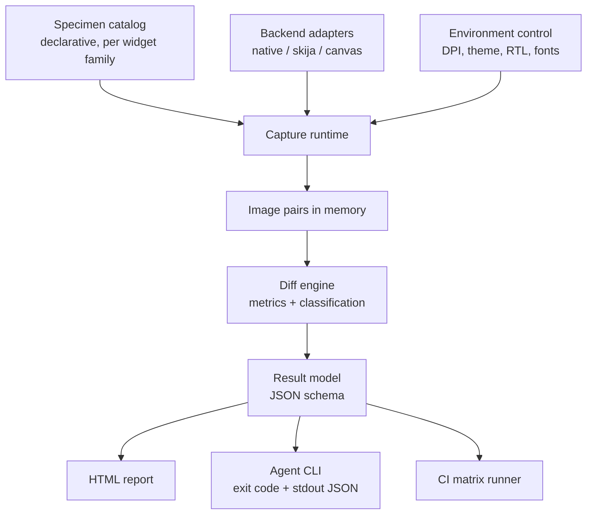

# SWT Visual Oracle: Plan

This document holds the design of the harness and the decisions behind it.
`SPI.md` is the authoritative interface contract, `CLI.md` is the usage reference, and `RESULT-SCHEMA.md` is the JSON contract.

## Goal

Build an automated visual oracle for SWT widget rendering.

For every widget, in every style, state, DPI scale, theme and text direction, the harness renders the widget twice in the same run, once through a reference backend and once through a candidate backend.
It then diffs the two images and reports the differences in a machine-readable form.

The primary use is comparing stock SWT against stock SWT: build the baseline from one git ref and the candidate from another, and the catalog answers whether an SWT change altered any pixel it did not mean to.
The same mechanism compares native SWT against an alternative rendering stack, which is how the Skija backends are covered.

The purpose is to remove the human from the inner loop.
Today a rendering regression is found by a person looking at a screenshot.
With this harness an agent can change SWT, run one command, and get a verdict, which makes unattended iteration possible.

## Non-goals

Not a golden-image suite: both sides of every comparison are produced in the same run, so nothing is stored between runs.
Not a performance benchmark.
Not a replacement for the existing JUnit suites.
Not a general screenshot testing framework for applications built on SWT.

## Key design decisions

### D1: Differential, not golden

Both sides of a comparison are produced in the same run, on the same machine, with the same theme and fonts.

Same run, but **not the same process**, see D6.

This removes the entire golden-image problem.
There are no baseline PNGs to store, to version, to regenerate per platform, or to review in pull requests.
A run is self-contained and its verdict does not depend on any previously recorded artifact.

Consequence: the harness cannot detect a defect that both sides share.
That is acceptable, because the question it answers is "did this change alter the rendering", not "is the rendering correct".

### D7: Stock SWT is compared against itself

`native-baseline` and `native-candidate` build stock SWT from a git ref or an SWT directory, so the same catalog answers "did this SWT change alter any pixel", with zero tolerance because both sides are the same renderer.
This covers ordinary SWT changes and a JNI to FFM migration, still without golden images, since the baseline is rebuilt from source in the same run.
Usage is in `CLI.md`, "Comparing two SWT versions".

### D6: One process per backend and environment, merged at the JSON level

Documented in `SPI.md`.

Two constraints make that impossible.
Each backend links its own natives and class output (ADR-002), so at most one backend can be active per process.
SWT reads zoom, theme and text direction once at `Display` creation, so one process serves exactly one `RenderEnv`.

A full comparison therefore runs several single-purpose processes, one per backend and environment combination, and compares their results as JSON rather than as live objects.
The result JSON is consequently not a convenience format, it is the comparison substrate, which is why its schema is a frozen contract.

No component may assume a shared `Display`.

### D2: Capture uses `GC.copyArea`, with an X11 grab as fallback

Recorded with evidence in `adr/ADR-001-capture-strategy.md`.

`Control.print(GC)` is **rejected**, for two independent reasons.
It is blind to the GL content the Skia canvas renders into its GLX child window: on a canvas that is 58 percent GL-painted it captured zero such pixels, a blank image.
Had the harness been built on it, every Skia specimen would have compared an empty image against native, and the failures would have looked like renderer bugs rather than a broken oracle.
Separately, its capture of a plain native `Button` hashes differently from both other strategies, which agree byte for byte, so it re-renders the widget rather than capturing what is on screen.

`GC.copyArea` is the primary strategy.
It sees GL content, runs at 0.52 ms per capture against 154 ms for a full screen grab, is byte-identical across processes, and stays crop-exact at zoom 200.

The X11 grab (`import -window root` plus crop) is kept as a fallback behind the same `Capture` interface, for anything `copyArea` cannot reach, such as a widget owning a native popup outside its own bounds.
Its crop origin is offset at zoom 200, capturing a shifted region, so it is only used at zoom 100.

### D3: Determinism is a hard requirement, enforced by a lint

Any specimen whose rendering depends on wall-clock time, animation phase, focus stealing, cursor position, or system locale is a flaky test.
The catalog is guarded by an automated determinism check: each specimen is rendered three times in one run, and any specimen whose own renders differ is failed as non-deterministic before any cross-backend comparison happens.

Known offenders to handle explicitly: `Caret` blink, indeterminate `ProgressBar` animation, `DateTime` defaulting to today, tooltips appearing on hover, and any widget that reads the system font by name.

### D4: Backends are adapters, so the harness outlives any single project

The harness must not hardcode a Skija implementation.
It talks to a `Backend` SPI with at least three implementations: stock native SWT, the prototype-skija fork, and the `SWT.SKIA` canvas from PR 3231.
A future lightweight, handle-free widget layer becomes a fourth adapter and inherits the entire catalog for free.

The build recipe is recorded in `adr/ADR-002-build-target.md`, and each backend is verified to genuinely activate rather than silently falling back to native.
One incompatibility surfaced there and matters to anyone comparing the two Skija efforts: `prototype-skija` pins Skija **0.116.3** with jars committed in its own tree, while PR 3231 expects **0.143.17** from Maven Central.
Each backend gets its own class output and classpath, so the versions never mix.

### D5: The agent-facing CLI is a first-class deliverable

The harness exists to be driven by agents.
The CLI contract is therefore part of the design, not an afterthought:

```
oracle run --widget Button --state hover --dpi 150 --format json
oracle triage --top 20
oracle selftest
```

Exit code is zero when every selected specimen is within tolerance, non-zero otherwise.
JSON on stdout is stable and documented, because agents parse it.

## Architecture



### Component responsibilities

**The frozen SPI** lives in `org.eclipse.swt.visualoracle.spi` and is documented in `SPI.md`, which states for each interface what implementers may assume and what is guaranteed to stay stable. Implementations live under `.impl`; nothing outside the harness may depend on them.

**Specimen catalog** declares what to render.
A specimen is a pure factory: given a parent `Composite` and a `SpecimenContext`, it creates exactly one widget in one defined state and returns it.
Specimens never open shells, never run event loops, and never capture anything.

**Capture runtime** owns the shell, the event loop settling, the forced redraw, and the capture.
It guarantees that a specimen is rendered identically given identical inputs.

**Environment control** sets DPI scale, theme, and text direction for a run.
On Linux this means `GDK_SCALE`, `GDK_DPI_SCALE`, `GTK_THEME`, and the SWT zoom properties.
On Windows it means the monitor scale and the SWT zoom properties.
Each combination is a separate process, because SWT reads most of these once at `Display` creation.

**Diff engine** compares two images and classifies the result.
Classification matters more than a single number: a one-pixel baseline shift, a missing focus ring, and a wrong fill color are three different defects and the report must distinguish them.

**Result model** is the stable JSON contract between the harness and everything that consumes it.

**Report** renders the results as a browsable HTML page with side-by-side images and a difference heat map.

**CI runner** executes the matrix headless and publishes the report.

### Build tooling

`tools/oracle/build.sh <backend>` prints a ready classpath for any backend.
Cold build 35 s, warm rebuild under a second, incremental on a source fingerprint, Maven Central jars pinned by sha256.
`tools/oracle/verify-backend.sh <backend>` asserts a backend is genuinely active rather than silently falling back to native.
`tools/oracle-spike/` is the capture spike, kept as executable evidence for ADR-001.

Anything needing a compiled SWT calls `build.sh` rather than writing its own `javac` invocation, which fails on the `../../` prefixes in `build.properties`.
